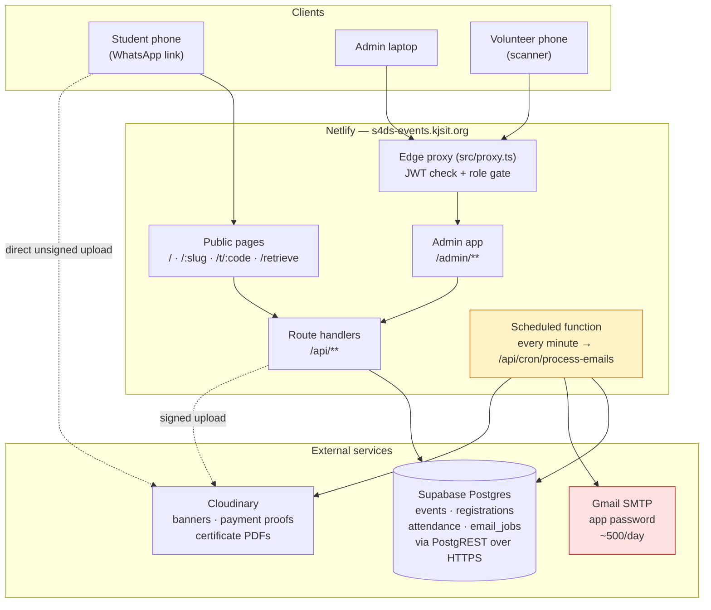

# System Architecture

Event registration → email ticket → QR attendance → certificates.
Single organizing committee (S4DS, KJSIT). Public events at `s4ds-events.kjsit.org/<event-name>`.

## System diagram



The two coloured boxes are the fragile parts — read the **Netlify** and **Email** sections carefully.

## URL design

The event slug lives at the **root**, which is what makes links shareable and clean:

| URL | Page |
|---|---|
| `/` | Homepage — Open for registration / Upcoming / Past |
| `/llm-masterclass` | Event page + registration form |
| `/t/KJS-7F3A9C` | Ticket with QR |
| `/retrieve` | Get my ticket resent |
| `/admin/**` | Admin + scanner |
| `/api/**` | Route handlers |

### Reserved slugs — this will break the site if skipped

Because events sit at the root, an event slugged `admin` or `api` would shadow real routes. The denylist is in [`src/lib/reserved-slugs.ts`](../src/lib/reserved-slugs.ts) and is enforced **in the Zod schema for event creation**, not just in the UI.

Route file is `src/app/[slug]/page.tsx`. It must `notFound()` on a reserved or unpublished slug. Real routes win over the dynamic segment in Next.js, so a reserved slug wouldn't render — it would just be a permanently broken event nobody can debug.

## Stack

| Layer | Choice | Notes |
|---|---|---|
| Framework | **Next.js 16 (App Router) + TypeScript** | Note: Next 16 renamed the `middleware` convention to `proxy` — the file is `src/proxy.ts`. |
| Styling | **Tailwind v4** + shadcn/ui | |
| Hosting | **Netlify** | `@netlify/plugin-nextjs`. See Netlify section. |
| Database | **Supabase Postgres** | Accessed over **HTTPS (PostgREST)**, not a raw 5432 connection. |
| DB client | **`@supabase/supabase-js`** with generated types | No ORM. See "No transactions" below. |
| Images / files | **Cloudinary** | See below. |
| Email | **Gmail SMTP + app password**, via `nodemailer` | ~500/day cap. See Email section. |
| Email templates | **React Email** → rendered to HTML, passed to nodemailer | |
| QR generate | `qrcode.react` | |
| QR scan | `@yudiel/react-qr-scanner` | |
| Certificates | **`pdf-lib`** + template PNG | |
| Validation | **Zod** | One schema shared by form and API |
| Admin auth | **`jose` JWT in httpOnly cookie** | `jose` works in the edge proxy; the DB client does not — never query the DB there |

### A practical side benefit of Supabase here

`supabase-js` talks HTTPS on port 443 to a short hostname. A direct Postgres connection needs port 5432 to a long provider-specific subdomain, which consumer routers, campus networks and ISP DNS block or refuse far more often. On a college network this is a real availability difference, not a theoretical one.

### Security model: RLS on, service_role only

Every table is RLS-enabled with **no policies**, so the anon key can read nothing. All access goes through the **service_role** key, which bypasses RLS.

This is deliberate — students have no accounts, so there's no user identity for a policy to key off. The consequence you must internalise:

> **Our route handlers are the authorization boundary.** Nothing below them protects the data. Every admin route calls `requireRole()`. The service_role key never gets a `NEXT_PUBLIC_` prefix and never reaches a client component — [`src/lib/supabase.ts`](../src/lib/supabase.ts) imports `server-only` so the build fails if it does.

### Cloudinary for files

- Netlify functions are stateless and can't write to disk.
- Students upload **directly to Cloudinary** with an unsigned preset, so a 4MB screenshot never passes through a Netlify function (which has a small request-body limit and would fail).
- Free tier (~25GB) is far beyond a few hundred registrations, with automatic image optimization for banners.

Setup: unsigned preset `event_uploads` (images only, 5MB cap, auto-compress, folder `s4ds/registrations/`); certificate PDFs uploaded **server-side with the API secret** as `resource_type: 'raw'`. Still compress client-side (canvas resize to ~1200px) before upload — faster on venue wifi.

Since we're on Supabase, **Supabase Storage** is a reasonable alternative that would cut one vendor. It's a smaller free tier (~1GB) with no on-the-fly image transforms. Worth revisiting if managing two accounts becomes annoying; not worth changing mid-build.

## Data model

The schema is SQL, in [`supabase/migrations/`](../supabase/migrations/):

- `0001_init.sql` — tables, enums, indexes, constraints, RLS
- `0002_functions.sql` — the two atomic operations (see below)

Types live in [`src/lib/database.types.ts`](../src/lib/database.types.ts). **If you change the SQL, change the types in the same commit** — a mismatch type-checks fine and fails at runtime.

Tables: `events`, `event_days`, `registrations`, `attendance`, `certificates`, `admin_users`, `email_jobs`.

### Form fields live in code, not the database

There's no form-builder UI and no `form_fields` table. Each event's `form_key` points at an entry in [`src/config/forms/index.ts`](../src/config/forms/index.ts):

```ts
export const FORMS = {
  'kjsit-student': [
    { key: 'roll_number', label: 'Roll Number', type: 'text', required: true },
    { key: 'department',  label: 'Department',  type: 'select', required: true,
      options: ['AIDS', 'COMPS', 'IT', 'EXTC', 'MECH', 'ETRX'] },
    // ...
  ],
  'open-public': [ /* ... */ ],
  minimal: [],
};
```

The form page reads the array and renders it; `buildAnswersSchema()` derives the Zod schema from the same array, so the form and the API can't disagree. Adding an event with different questions is a one-line edit plus a deploy.

`full_name`, `email` and `phone` are columns on every registration and are never in the registry. A field `key` is permanent — renaming one orphans the answers already collected. `getFormFields()` throws on an unknown `form_key` rather than silently rendering a form with no questions.

### Four decisions worth understanding

1. **The QR encodes `qr_token`, not `code`.** A guessable QR payload means anyone can forge a ticket and be marked present. `code` (`KJS-7F3A9C`) is the friendly identifier we show and search by; `qr_token` is 32 random bytes.
2. **`unique (event_id, email)`, not a global unique email.** Global unique means a student can register for exactly one event ever. This is the most common way this schema gets built wrong.
3. **Attendance references an `event_days` row, not a day number.** That's what makes multi-day events work without hardcoding "day 1 / day 2".
4. **Files are Cloudinary URLs.** Never base64 in a column — a few hundred 4MB blobs make the admin table crawl.

### No transactions — this changes how you write code

`supabase-js` has no interactive transactions. You **cannot** read, decide, and write inside one transaction from application code the way Prisma's `$transaction` allowed.

Anywhere a read-then-write race would corrupt data, the logic lives in a Postgres function called via `db.rpc(...)`. There are exactly two, both in `0002_functions.sql`:

| Function | The race it prevents |
|---|---|
| `register_for_event(...)` | Two students take the last spot simultaneously; both read `count = 69` against capacity 70, both insert. Locks the event row with `FOR UPDATE`. Raises `CAPACITY_FULL`, `REGISTRATION_CLOSED`, `DUPLICATE_EMAIL`. |
| `claim_email_jobs(limit)` | A slow cron run overlaps the next one; both read the same `QUEUED` rows and every recipient gets the email twice. Uses `FOR UPDATE SKIP LOCKED`, and recovers jobs stuck in `SENDING` for over 5 minutes. |

**If you're writing "read, check, then insert" in a route handler, it probably belongs in a SQL function instead.** Ask before adding one — it's a schema change.

Duplicate scan prevention needs no function: the `unique (registration_id, event_day_id)` constraint does it, and the API catches error code `23505` (`isUniqueViolation()` in `src/lib/supabase.ts`).

## Homepage sections

One query, grouped in code — this is what the `(status, starts_at)` index is for:

| Section | Condition |
|---|---|
| **Open for registration** | `PUBLISHED`, now within the registration window, spots remain |
| **Upcoming** | `PUBLISHED` and `starts_at > now` but registration not currently open |
| **Past** | `ends_at < now` — recap and attendee count, no register button |

Compute "now" on the server. Comparing dates in the browser gives different results for different students' clocks.

## API contract

Agree on this before anyone writes code — it's what lets four people work in parallel.

### Public

| Method | Route | Body / Returns |
|---|---|---|
| `GET` | `/api/events` | homepage list, pre-grouped into the three sections |
| `GET` | `/api/events/[slug]` | event + days + resolved form fields + `spots_left` |
| `POST` | `/api/events/[slug]/register` | `{ full_name, email, phone, answers, payment_proof_url? }` → `{ code }`. Calls `register_for_event` RPC |
| `GET` | `/api/tickets/[code]` | registration + event + per-day attendance |
| `POST` | `/api/tickets/retrieve` | `{ email, event_slug }` → **always `202`**, queues the email. Never reveal whether an email exists |

### Admin (behind the proxy)

| Method | Route | Role |
|---|---|---|
| `POST` | `/api/admin/login` · `/api/admin/logout` | — |
| `GET/POST` | `/api/admin/events` | ADMIN |
| `PATCH/DELETE` | `/api/admin/events/[id]` | ADMIN |
| `GET` | `/api/admin/events/[id]/registrations` | ADMIN — paginated, filterable |
| `PATCH` | `/api/admin/registrations/[id]` | ADMIN — approve / reject |
| `GET` | `/api/admin/events/[id]/export` | ADMIN — CSV |
| `POST` | `/api/admin/scan` | SCANNER |
| `GET` | `/api/admin/events/[id]/stats` | SCANNER — live counts |
| `POST` | `/api/admin/events/[id]/certificates` | ADMIN — generate + queue |
| `POST` | `/api/cron/process-emails` | `CRON_SECRET` header |

### `/api/admin/scan` — agree on this exactly

The scanner UI is driven entirely by this. Every case must be distinguishable in under a second, one-handed, outdoors, with a queue waiting.

```ts
200 { result: "OK",           name, code, day_label }
409 { result: "DUPLICATE",    name, scanned_at }
404 { result: "NOT_FOUND" }
403 { result: "NOT_APPROVED", name, status }
403 { result: "WRONG_EVENT",  name, event_title }
```

## Netlify specifics

Netlify was chosen for CI/CD, and it does that well — but it is not Vercel, and three things differ.

**1. Verify `@netlify/plugin-nextjs` supports Next.js 16.** Netlify's Next runtime trails new Next majors. The plugin is pinned in `devDependencies`; the real proof is the first deploy. Do it on day 1.

**2. No Vercel Cron.** A **Netlify Scheduled Function** ([`netlify/functions/process-emails.ts`](../netlify/functions/process-emails.ts)) calls our route handler every minute, so all the queue logic stays in normal Next.js code that can be run and tested locally.

**3. Function timeout is short** (~10s default, ~26s max depending on plan — verify yours). This is the biggest constraint on the email worker:

- Each run claims **at most 5 jobs** via `claim_email_jobs(5)`. Gmail SMTP takes ~1–2s per message.
- At one run per minute that's ~300 emails/hour. A 200-person certificate batch takes ~40 minutes to drain. Fine — just not instant.
- **Certificate PDF generation is a separate job type from sending.** Generating 200 PDFs in one invocation will time out.

Also: the proxy runs as a Netlify Edge Function, so it can only verify the JWT with `jose`. Any database call there will fail. Role checks that need the DB belong in the route handler.

## Email — Gmail SMTP

`nodemailer` + `smtp.gmail.com:465`, authenticated with a **Google App Password** (requires 2FA on the account; generated at myaccount.google.com → Security → App passwords).

Wrap it behind one interface so the provider can be swapped in a single file:

```ts
// src/lib/email/send.ts   ← the ONLY file that knows about Gmail
export async function sendEmail({ to, subject, html, attachments }: SendArgs): Promise<void>

// src/lib/email/queue.ts  ← the ONLY function other tracks call
export async function enqueueEmail(job: { to, template, payload, registration_id? }): Promise<void>
```

**Constraints to design around, not discover later:**

- **~500 emails/day** on a free Gmail account (~2000 on Workspace). A 300-person event's confirmations are fine; confirmations *plus* certificates on the same day are not. The queue survives it — a rate-limit failure marks the job `FAILED` with a retry and it drains the next day — but plan the certificate send for a different day than a big registration push.
- **Deliverability is the real risk.** Bulk mail from a personal Gmail lands in spam or Promotions. Use a dedicated account, keep subject lines plain, avoid image-only emails, always include a plain-text alternative, and **send yourself test mail from a non-Gmail address** before an event. If the college can provide a Workspace account on `kjsit.org`, use it — same-domain sending is dramatically more trusted.
- **Never send inside a request handler.** Registration writes an `email_jobs` row and returns immediately.

## Environment variables

```
SUPABASE_URL=                  # https://YOUR-PROJECT.supabase.co
SUPABASE_SERVICE_ROLE_KEY=     # bypasses RLS — server only, never NEXT_PUBLIC_
SUPABASE_PROJECT_ID=           # only for `npm run db:types`

CLOUDINARY_CLOUD_NAME=
CLOUDINARY_API_KEY=
CLOUDINARY_API_SECRET=         # server only
NEXT_PUBLIC_CLOUDINARY_CLOUD_NAME=
NEXT_PUBLIC_CLOUDINARY_UPLOAD_PRESET=event_uploads

GMAIL_USER=s4ds.events@gmail.com
GMAIL_APP_PASSWORD=            # 16-char app password, not the account password
EMAIL_FROM="S4DS KJSIT <s4ds.events@gmail.com>"

AUTH_SECRET=                   # 32+ random bytes, signs the admin JWT
CRON_SECRET=

NEXT_PUBLIC_APP_URL=https://s4ds-events.kjsit.org
```

`.env` is gitignored; `.env.example` with empty values is committed. Real values go in Netlify's env UI and a shared password manager — never in the group chat.

## Gotchas, decided upfront

- **Reserved slugs** — enforced in Zod on event create, or you'll eventually publish an event that shadows `/admin`.
- **Capacity race** — use the `register_for_event` RPC. A `count()` in a route handler is wrong.
- **Scanner needs HTTPS** for camera access. Test on a phone using the Netlify deploy preview URL, never `localhost`.
- **Venue wifi will be bad.** Scan requests must be fast with a clear pending state. Offline queue in `localStorage` is a stretch goal, not v1.
- **Certificates are idempotent.** `certificates.registration_id` is unique — rely on it so clicking "issue" twice can't double-send.
- **Supabase free tier pauses after ~7 days of inactivity** and needs a manual restore from the dashboard. Between events, the site can go down until someone clicks restore. Put a reminder in the group before every event, and check the dashboard the day before.
- **DNS for `s4ds-events.kjsit.org`** needs a CNAME to Netlify, added by whoever administers `kjsit.org`. That's a college IT request with a lead time — start it in week 1.
